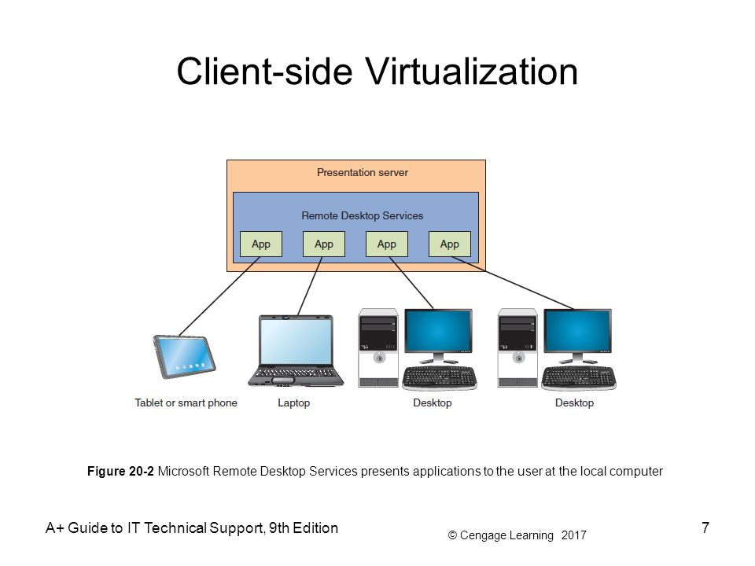
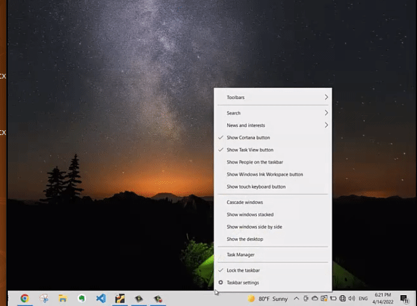
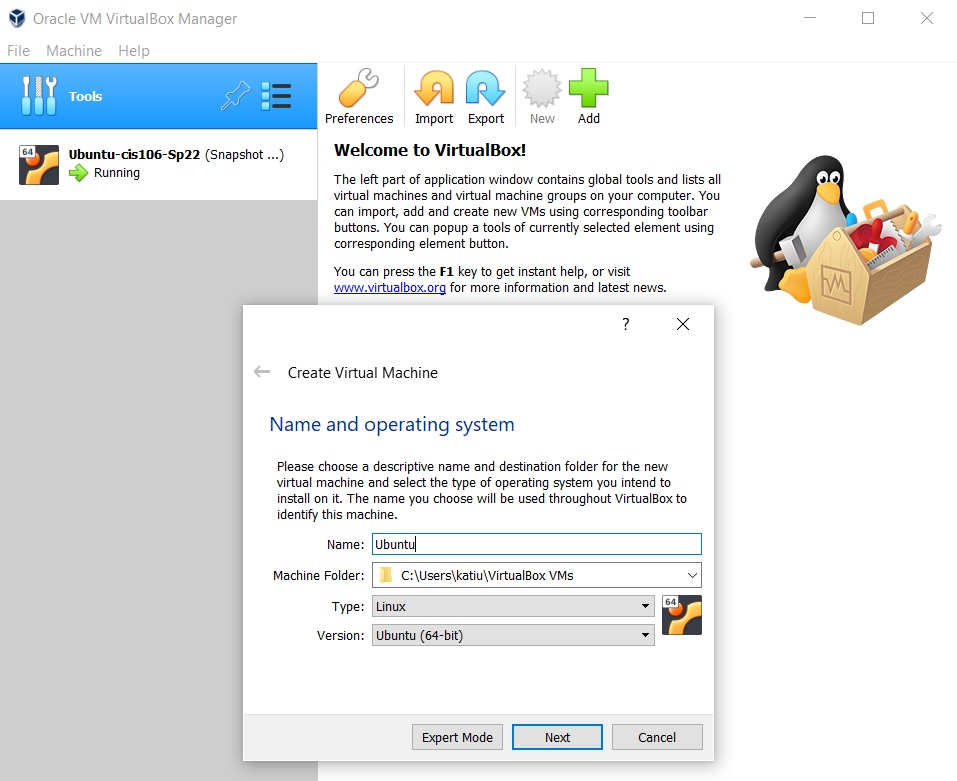
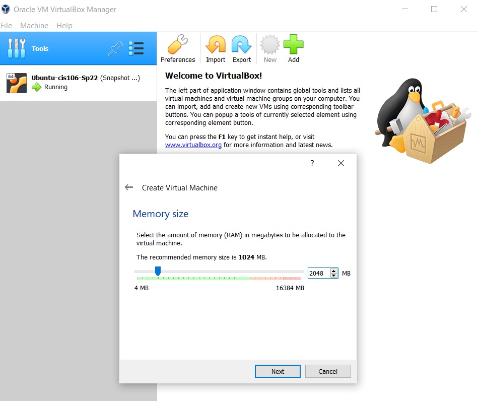
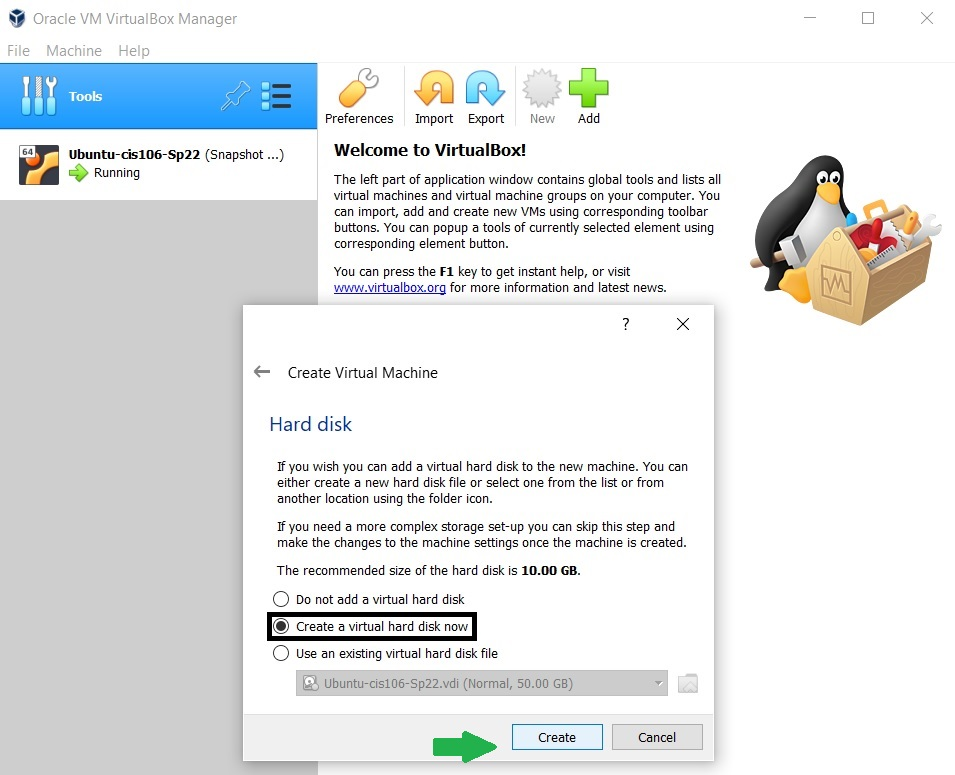
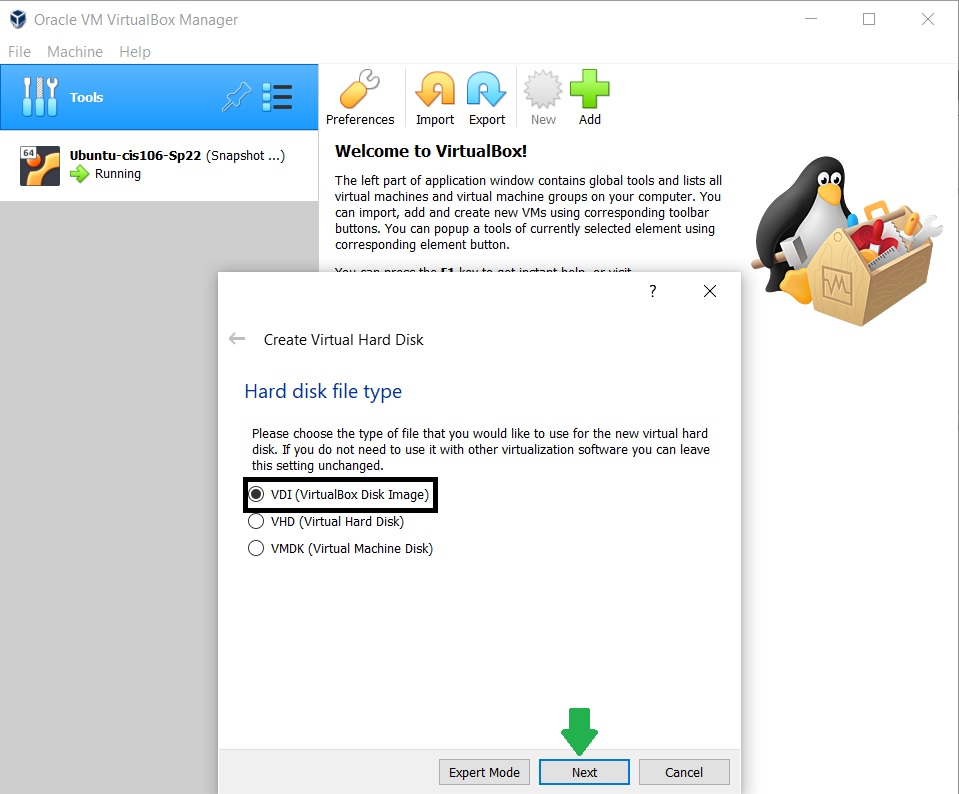
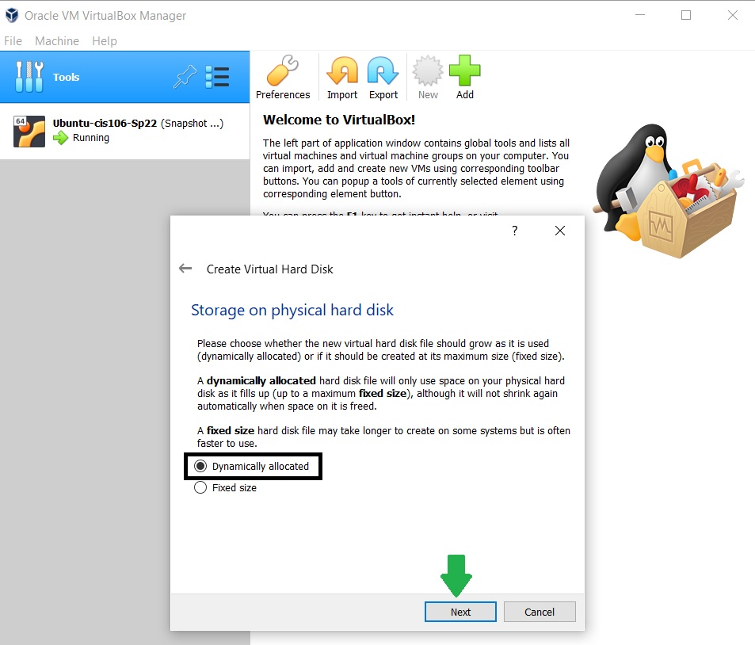
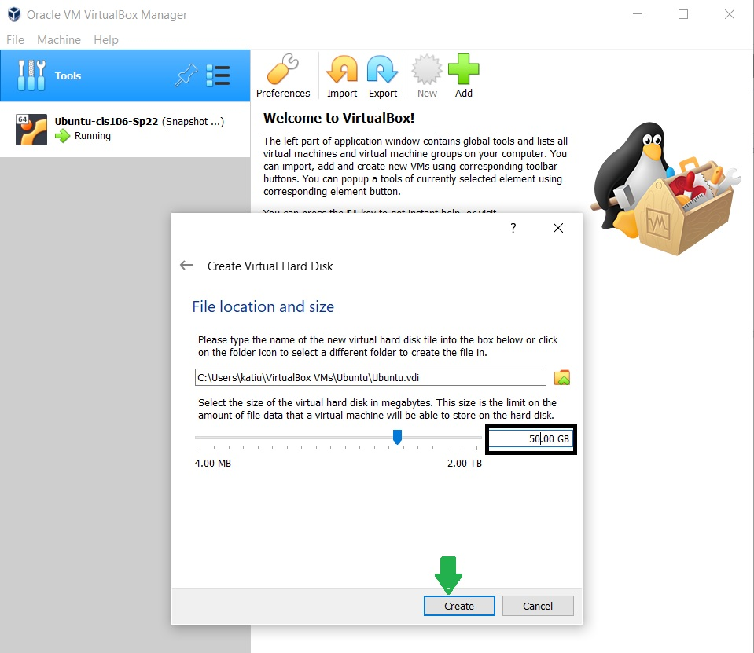
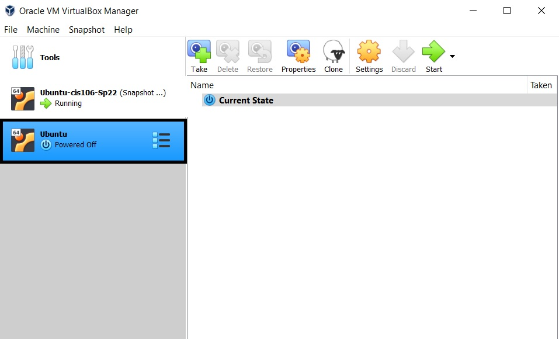
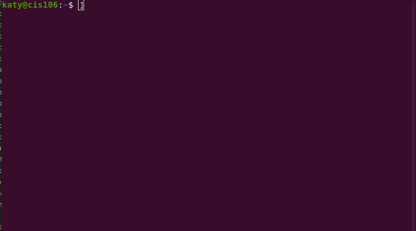

# Deliverable 2

 ##  
    What is Virtualization?

 It is the process of simulating a  whole computer within an existing one allowing users to run multiple operating systems simultaneously.Virtualization converts physical resources into virtual resources for the virtual machine, allowing users to maximize their computer's capabilities. 

### Types of virtualization
* **Server side virtualization:** 
 

  
This types of virtualization provides a virtual desktop for users on multiple client machines and a virtual desktop infraestructure.

* **client side virtualization**:
   
Client-side means that the action takes place on the user’s (the client’s) computer. In this type of virtualization each computer has its own operanting system and need a hypervispr to manage the virtual machiche.
  

  
### 
Hypervisor

 A hypervisor is a program that allows users to create and run virtual machines. An example of a hypervisor is Oracle VM VirtualBox.

### Types of hypervisors
   * Type 1 : this types of hypervisors are loaded directly on the physical server hardware . It replaces the Os that you are using.ex,Vmware ESX/ESXI.
  
   * Type 2 : this type of hypervisor will be load into an existing operating system that is already installed on the hardware. ex,Vmware workstation player/pro and Oracle virtualbox.
   

   ## 
 Virtualbox

### How to install virtualbox in windows 10
1 - Click  the following link to go to Oracle download page : https://www.virtualbox.org/wiki/Downloads

2- Click in Windows hosts link.Then, the download will automatically start.

3- Double click on the executable file to lauch the installer.

4- Click the Next button.

5- Keep the default setting as they are ,and hit the Next button.

6- Click the install button.

7-Click the Finish button.

### How to create a virtual machine
- Step 1 :Make sure that virtualization is enabled in your computer.
 
 
- Step 2:
  Click the new icon above and give a name to your virtual machine
 

- Step 3 : add the memory size.For this particular example ,I assigned 2048MB of RAM.
 

-Step 4: Select the option to create a virtual hard disk now .Then click create.
 

- Step 5: make sure you had the VDI selected because we will be using a Disk image.
 

- Step 6:Select Dynamically allocated.then click the Next button.
 

- Step 7 :In this step you can change the size of your hard disk.then click the create button.
 

- Step 8: As you can see a new virtual machine has been created called Ubuntu.
 

    
##  
Installing Ubuntu in Virtualbox 

- Step 1 : Click the setting icon.
  

- Step 2: on the left panel,click system.
   

- Step 3: unselect the floppy option

  

- Step 4: Click the arrow and place the optical disk option to be the first option.

   

- Step 5: Additional steps to have a better performance . Place a 2 on processors.

   

- Step 6: Additional steps to have a better performance.move the arrow all the way to the right on the video memory option.

   

- Step 7: Click storage.Under controller :IDE, select the empty option.then select the disk and click on choose a disk file to look for the Iso image.

  

- Step 8 : Click the start button

   

- Step 9 : Select the preferred language.
  

- Step 10 : Use your keyboard to move around the options.Then press enter on "Install Ubuntu".

   

- Step 11 : Select the language of preference and click continue.

   

- Step 12 : make sure that you have selected the normal installation option.
   

- Step 13 : Select your location.
   

- Step 14: In this step you will configure the user name ,the computer name and the password for your Os.Then click the continue button.
   

- Step 15 : Ubuntu installation start.
   

- Step 16 : Installation complete.
   

- Step 17 : log in with your password.
   

- Step 18 : All set , Ubuntu is ready to use!
   

### 
 Updating Ubuntu

Step #1 - Go to the terminal. To go to the terminal press `ctrl + t`
Step #2 - Type the following command:

### 
Installing Software in Ubuntu

- The sintax for installing software in Ubuntu is the following:
 `sudo apt install add-name -y`
  - 

- Searching for software
  - Syntax :`apt search “add-name” `
   - 

- Deleting software
  - Sintax:`sudo apt remove add-name -y`
   - 
- To add and remove software in a single line  use the `purge` command:
   - `sudo apt purge softwarename+  softwarename- `
   - 

## 
Basic Linux commands

### Navigating the filesystem
|Command          |definition                                                               |example                                                                  |
|-----------------|-------------------------------------------------------------------------|-------------------------------------------------------------------------|
|pwd              | It displays the current working directory                                   |pwd                                                                      |
|cd               |It is used to change the current working directory                             | `cd  ~ /$HOME` (this will take you home).`cd -`(go to previous current working directory).`cd ../`(go back the current working directory)|
|ls               |It displays all file inside a given directory or current working directory  |`ls \Downloads`(show file in downloads).`ls -a `(show all files including hidden file).`ls -LR ~/Downloads`(long list all files recursively) .  |

### Managing files and directories

|Command        |  Definition                                                  |   Syntax                             |     Example                     |
|---------------|--------------------------------------------------------------|--------------------------------------|----------------------------------|
|   mkdir       |this command is used to create directories.                   | `mkdir + Option + directory_name`    | `mkdir pictures `                |
|               |To create multiples directories in a single line              | `mkdir + option + name1 name2 ..`    | `mkdir movies music photos `     | 
|               |To create directories inside a parent directory.              | `mkdir -p parentdirectory/child1/`   | `mkdir -p photos/summer/fall`    | 
|  touch        |this command is used to create files.                         | `touch + file name `                 | `touch notes.txt   `             |
|               |to create multiples files in a single line.                   | `touch + name1 + name2 +... `        | `touch notes.txt webpage.html`   |
|  rm           |this command is used to remove empty files                     | `rm+option+location of the file`     | `rm ~/Download/notes.html`       |
|   Option[-r]  |To remove empty/nonempty directories                          | `rm -r +location of the directory`   | `rm -r ~/Download/photos   `     |
|   Option[-i]  |this option  ask for conformation before removing a file      | `rm -i +location of the file `       | `rm -i ~/Download/notes.txt`     |
|  rmdir        |this command is used to remove empty directories               | `rmdir +option + directoryname`      | `rmdir ~/Downloads/pictures `    |
|  mv           |this command moves files and directories                      | `mv  + source + destination`         | `mv ~/Downloads/pictures  /Documents/pictures`|
|               |change the name of a files/directory and moving it.           | `mv+source/name1+destination/name2`  |`mv ~/Downloads/pictures  /Documents/picturesSummer`|
|  cp           |copy files/directories to a new destination                   |`cp +file's name+ destination  `      |`cp Downloads/img1.png  Pictures/`|
|               |copy multiples files in a single line                         |`sudo cp -r file1 file2 +destination `|`sudo cp -r  ~/txt1.txt txt2.txt  ` `~/Desktop`  |
| man           | this command displays a manual                               | `man + name of the command`          |`man cd`                          |
|*              |It matches anything and nothing matches any number of characters|    *                               | `ls *.txt`                       |
|?              |wildcard indicate exactly one character or more.              |  ` f?ilename  `                      |`ls t?xt.txt`                     |
|[]             |It matches a single character in a range                      |  `f[character]`                      |` ls p[aeiou]*`                   |
|[!]            |It matches all except what is inside the brackets             |  `![]  `                             | `ls [!ae]*`                      |

## 
Extra examples of wilcards

https://en.wikipedia.org/wiki/Hypervisor