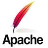
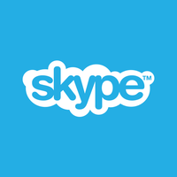
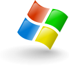

# Deliverable 1

## 
Introduction

When you hear the word operating system, what is the first thing that comes to mind? Perhaps Windows because it is such a popular operating system amount others. However, what if people want more than this Os has to offer? Something more customizable, secure, and adaptable. This can be acquired by using an open-source called Linux. This project, in particular, will be about using one distribution of Linux called Ubuntu, which according to "http://www.ubuntu.com", had won the trust of at least twenty million people all over the world. This project aims to encourage curious individuals to step outside of their comfort zones and investigate what this operating system has to offer as a daily operating system through the use of a virtual machine.

## 
Project hardware and software requirements

### Hardware requirements
* A Computer that can virtualize.
  What is virtualization? is the process of simulating a  whole computer within an existing one allowing users to run multiple operating systems simultaneously.
How to know if your computer is capable of virtualizing? to virtualize your computer must have the following requirements: 
    - 2GHZ dual core processor ,
    - 8 Gb system memory,
    - 50 GB of free hard drive space,internet access.
### Software requirements 
* A hypervisor must be installed on your computer.
 What is a hypervisor? A hypervisor is a program that allows users to create and run virtual machines. One example of a hypervisor is Oracle VM VirtualBox.

  

## 
What is Linux?

Linux is an open-source operating system created by Linus Torvalds in the early 1990s. The term Linux applies to the Os or the Linux Kernel. The Linux kernel is the heart of the operating system, whose principal function is to be an intermediary between the software and the hardware. Besides the Kernel, it contains libraries, web browsers, and other programs. This Os is very popular as a web server. However, it is used, as well, in many other areas such as network Os, cloud Os, and software development.

### 
Short history of linux

  

- In August 1991, Linus Torvalds announced that he was doing a free operating system as a hobby, but it was not very portable because it only works on 386 computers.
- It was relicensed under the GNU GPL in 1992.
- In 1993, distributions such as Slackware and Debian were released.
- The kernel was complete in 1994, and the first version of Linux, version 1.0, was released. Only the Intel 386 or 486 processors were compatible with this version.
- Version 1.2 was released in 1995. Other hardware, such as DEC Alpha, MIPS, and Sun SPARC, can be adapted to this version.
- Version 2.0 was released in 1996. The important feature of this version is that it supports SMP. Linux was able to migrate into the server space at this point. In addition, work on version 2.1 has begun.
- In 1999, the kernel version 2.2 was released. The most important aspect of this version was the global spinlocks removed and frame buffer for the console.
- In 2001, Linux kernel 2.4 was released. This includes USB, Bluetooth, and ext3(journaled file system). The development of version 2.5 takes place.
- In 2003, Linux 2.6 was released. This version includes a new scheduler, which always completes its algorithm in a fixed amount of time. 
- In 2007, Android was released.

### 
Linux distribution

  

* **Slackaware**:
 

  

Slackware was created in 1993 by Patrick Volkerding. It was developed to be as much Unix-like as possible. One of the benefits of using Slackware is stability. Even though Slackware was developed in the early 90s, it has continued to work without any problems. This distribution had been adapted nicely throughout the time without drastic changes. Another benefit of this distribution is security. Slackware does not have problems with traps and pitfalls. For instance, the new versions of Slackware do not come out until everything is ready.

* **Debian**:
 

  

The Debian project started in 1993 with the alliance of a group of volunteers with a common cause which was to create a free operating system. This project is called Debian. Debian is considered to be the Grandfather of all Linux distributions. This operating system uses the Linux kernel. Some of the most popular distributions based on Debian are Linux Mint, Kali Linux, Parrot Os, Linux Deepin, Mx Linux, and steamOs.

  
> **Debian based Linux Distributions**
 > Ubuntu : The word Ubuntu means “humanity to others” and “I am what I am because of who we all are.”  Ubuntu is one of the most popular Linux distributions developed by Canonical and founded by Mark Shuttleworth. Ubuntu Linux is created based on another distribution called Debian. Debian was an open-source, which was very popular at that time. However, it represents difficulty to install. So, Shuttleworth took Debian and changed that. Shuttleworth created its Os with the Debian foundation, which he named Ubuntu. Throughout time, Ubuntu has become very popular for its user-friendliness. For example, it has many desktop environments like KDE, LXQT, MATE, GNOME, and Xfce. Giving the user the flexibility to choose the one they like more. Ubuntu is a very secure Os. Ubuntu is an open-source where thousands of people work to fix issues and security loopholes.  The Os has its store called Ubuntu software which provides you with a lot of apps to try.
 >
> Kali Linux: On March 13th, 2013, Kali Linux was released. Mati Aharoni created this Linux distribution, which is based on Debian. Kali Linux is used for network analysts, penetration testers, and other cybersecurity and analytic professionals. Kali Linux is a free multi-platform solution for information security professionals and enthusiasts.

   

  
  

* Red Hat Enterprise Linux:  is a  Linux distribution aimed at the commercial market developed by Red Hat. Red Hat Enterprise Linux is available in server and desktop variants. For example, x86 and x86 64 processors. As well as Itanium, PowerPC, and IBM System z architectures. Red Hat uses restrictive trademark measures to prohibit free re-distribution of its officially supported versions of Red Hat Enterprise Linux, although its source code is freely available. 

> Fedora: In 2003, it was introduced as a Linux-based operating system. It is primarily used at the corporate level. This operating system is more user-friendly than Red Hat Enterprise Linux. In Fedora Linux, the GNOME desktop environment is the default desktop, with the GNOME Shell as the default interface. There are also desktop environments such as KDE, Xfce, LXDE, MATE, and Cinnamon.

## 
Open Source 

In open-source software, the source code is publicly available. As result,  programmers can see and modify the code. What is the source code? is the set of instructions written in a programming language that the computer can understand.

### Advantages of open source
- It is free.
- Because the code is freely available, anyone in the globe may patch issues, add features, and enhance performance in a short amount of time.

### Disadvantages of open source
- Open source may not be as user-friendly.
- It may be difficult to find technical support for unpopular programs.
  

|    Software     |  License                 |      Logo                           |
|-----------------|--------------------------|-------------------------------------|
|LibreOffice      |     GPLv2                | |
|Mozilla          |     GPLv2                |          |
|Apache web server|     GPLv3                |            |

### 
Closed Source

Closed source software, sometimes known as proprietary software, is a type of software that is not accessible to the public. Because the public does not have access to the source code, they are unable to alter it.

### Advantage of closed source
- It is more stable.
- It is easier to get customer service.

### Disadvantage of closed source
- Cost
- Bugs and missing features takes more time to be fix.
  
|  Software  |    License       |       logo                         |
|------------|------------------|------------------------------------|
|  Skype     |   Proprietary    |             |
|  Winrar    |   Trialware      |           |
|Microsoft Windows |Proprietary ||

## 
The Free software movement

The free software movement advocates for the freedom of owner computers to improve, change, study, or copy software. The four basic freedoms are granted to users by free software.

### The 4 freedoms
   - Freedom 0 : freedom to run the software for any purpose.
   - Freedom 1 : freedom to study the source code and change it..
   - Freedom 2 : freedom to redistribute copies.
   - Freedom 3 : freedom to redistribute your modified software. 

### GPL GNU
What it stands for is the GNU General Public License. This is the most widely used copyleft license in the world. The GPL aims to protect the rights of both writers and users, as well as the four freedoms.

## Sources
https://www.slackbook.org/html/introduction-slackware.html
https://www.slackware.org/
https://distrowatch.com/table.php?distribution=debian
https://www.geeksforgeeks.org/introduction-to-kali-linux/
https://distrowatch.com/table.php?distribution=redhat
 https://www.youtube.com/watch?v=sheqhcrE1gs&t=5s&ab_channel=GaryExplains
https://www.gnu.org/home.en.html