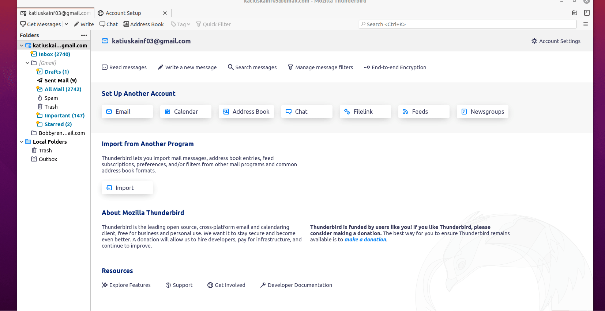
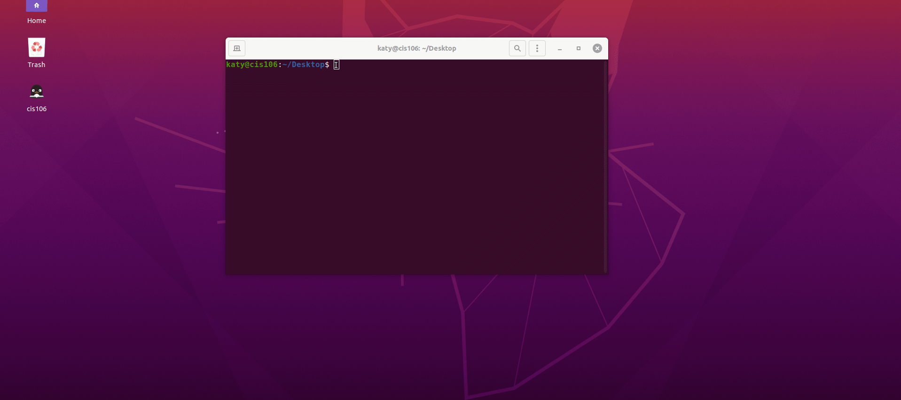

## Deliverable 3

## Connecting Ubuntu to the internet
Allowing users to connect to the internet is a must in every operating system. Creating a connection between your pc and your router can be easily done by following the next steps:
- Allocate the system menu which is on the right top bar.
- click on wi-fi not connected
- click on select network
- Click the network of preference. Then, enter the password and click Connect.
   
    
## Every day tasks In Ubuntu
        
### Internet browsing
Browsing the internet is possible by the use of a software program called a web browser. The web browser is what users used to search their favorite web pages such as Facebook, Instagram, Youtube, etc.

 

#### Mozilla browser:
 Mozilla Firefox: is an open-source web browser developed by the Mozilla foundation that comes within the OS ubuntu. This web browser is available for Linux, Mac, and windows. Some interesting features of this web browser are tabbed browsing, spell checking, smart bookmarks, and more. This web browser came by default in the Ubuntu os.

#### Alternatives :
  

* Google Chrome : 
It is a free web browser created by Google for browsing internet pages. Google chrome is the most common web browser worldwide. This web browser has different tools such as the back, history, bookmarks, and settings.
* How to install:
  
  * Link to download the deb package: https://www.google.com/chrome/?brand=CHBD&geo=US&gclid=Cj0KCQjwsdiTBhD5ARIsAIpW8CICfoB1A4AobNQSuTsRKbCWe20DQfmfwXOe0OjCjEybHOZXEd2RkPMaAn_AEALw_wcB&gclsrc=aw.ds
  
  * Installing using the terminal : `sudo apt install /Downloads/debpackage`

  * Installing using the software center: double click the package.
  
* Lynx:
 Users of ubuntu can navigate the internet on the terminal by using a text-based browser. For this project , I will be using lynx.
* How to install Lynx:
  *  
  * How to use linx:
Linx is an easy way to browse anything from the terminal. To launch the website write the lynx + the website + enter key. because it is a text-based browser user must use the arrow key to move around. Besides, be aware that after you enter a website, at the bottom, it will be a prompt waiting to be authorized to accept cookies .so you will have three different options always, yes(y), or no(n). Noticed that at the bottom is the menu with helpful options. such as how to exit the browser option or the help page.
 

 
 
### Reading email
Email messages have become one of the primary ways to reach or communicate with others at school and work. Ubuntu offers a variety of client email services that users can easily download and used.
 
#### Thuderbird mail 
Thunderbird mail is a client email service included with the Ubuntu operating system.
The Mozilla Foundation created it as an open source project.Users can send and receive messages in Thunderbird. It has a simple design that makes it very easy to utilize. 

* How to send messages in thundermail
   

#### Alternatives :
 
 *  Mailspring : is another alternative is Mailspring .Mailspring is an open-source email client platform that saves all the emails on the computer allowing access anytime.

  * Link to download: https://getmailspring.com/download
  * Installing using the terminal : `sudo apt install /Downloads/debpackage`

  * Installing using the software center: double click the package.

### Remote assistance
In the workplace and for training, remote support is quite beneficial.Remote assistance is a computer software that can aid others in resolving problems or completing tasks. Outsiders can monitor your screen and move your mouse from another computer using this type of application.
 

 
#### TeamViewer:
 It is one of the most popular remote assistance programs. It is available in Windows, Mac OS, Chrome OS, and Linux. It is considered to be the most secure and reliable app for remote desktop sharing.

- Link to Downloads: https://www.teamviewer.com/en-us/?utm_source=google&utm_medium=cpc&utm_campaign=us|b|pr|19|jul|Brand-TeamViewer-Exact|free|t0|0|dl|g&utm_content=TeamViewer_Exact&utm_term=teamviewer&gclid=Cj0KCQjwsdiTBhD5ARIsAIpW8CJUNDMulq6yHt829UhUJ8o7RvDQjNZ1o9zQ4J9hYSm82tv_BcaDYS8aAqYEEALw_wcB

### Office productivity (writing documents, editing spreadsheets and doing presentations)

Office productivity is a group of software associated with business needs.For example,document redaction,PowerPoint presentations,excel program,etc. 

  

#### Microsoft Office 365 online:
Microsoft Office 365 Online is a web-based version of Microsoft Office that lets you create and edit documents in Word, PowerPoint, Excel, and OneNote. 
- link to create an account : https://www.office.com/ 

#### Alternative: 
 
* LibreOffice:
It's an open-source suite that comes with the Ubuntu operating system by default.This application provides a straightforward interface with a number of useful tools.Libre Office included programs for writing papers, creating presentations, calculating, and more. 
        
### Streaming music and video
Enjoying music and video is something that users can accomplish as well on Ubuntu Os. Besides using the browser to stream their favorite media, users can download apps that by design are created for this purpose.

 
#### Spotify: 
It is one of many apps that are dedicated to stream your favorite music. The process of installing the app is simple

#### Alternative:
 
-  Kodi: is a media player application that is available in Microsoft Windows, Mac os, and Linux. It allows users to stream videos, podcasts, and music from the internet along with digital media files from local storage media. Kodi can be downloaded from the software center of Ubuntu os.

### Video games
The gaming library in Linux has been growing. As a result, it is considered to be the most popular platform for playing video games. Nowadays, many Windows games are available to play on Linux courtesy of open-source developers.

 
#### Steam : 
It is one of the most popular digital distribution platform in the gaming community. To use steam, users must create an account in the steam website. In your account will be placed you method of payment.All your video games will be store into a virtual library linked to your account. Users can access to it through the steam website or the app. In addition,users can installed the app in many devices as they want.Some interesting feautures about steam are a built-in chat where users can interact with others gamers,system of achievement, and the most important part is the variety of games available to play.

 
You can locate Steam withinside the Ubuntu Software app ,or through the command line: sudo apt install steam

### Video Chatting/calling/conferencing
Communication via video calling is a way to interact with people all over the world. This kind of interaction has become very useful these days with online classes. Using Ubuntu you can log in to your browser to pages such as hangout, zoom, etc. However, you can download applications as well.

 
#### Skype:
 It is a platform that allows users to communicate with others through video conferencing, instant messaging, and call only. Users can utilize this platform through a web browser or by using a dedicated application. Skype is an excellent option to communicate with others free of cost and with a variety of options.

### Texting/Instant messaging

Instant messaging is a user's favorite informal way to communicate with friends and family. it is text-based communication between one or more people.
 
 
#### Whatsapp: 
It's a messaging app for cellphones, tablets, and computers.It is used to deliver people text messages as well as multimedia.There are other fascinating options like video call and call-only.Users can use the website or the WhatsApp for Linux app to use this app. 

* This app can be easily downloaded from the software center or through the command line:
`sudo snap install whatsapp-for-linux`
### Programing
Coding is part of some people's routine. In Ubuntu operating system, users can create and run a variety of programming languages including JavaSCript, C++, C, etc.

- How to program using the terminal:
 

- Steps:
1- Open terminal
2- Create a file with the extension .cpp. For example, `touch hello.cpp`
3-Open the file into a text editor. In this case ,I used the vi editor. In order to open it type the following command: `vi hello.cpp`
4-To write the statements on the text editor press i.then, add the library neccesaries and add the code presented above.
5-To save and exit the vi . press the Esc keyword . then type `:wq`
6-Back to the terminal type g++ following by the name of the file `hello.cpp` -o(binary) and the new name of the program.out(this is  the result of compiling your program)
7- Open the program `./hello.cpp`

### Educational Applications (dictionaries and that kind of stuff)
Ubuntu offers a wide range of educational computer software.
Different areas of research have educational applications.
Consider math or the sciences.These applications offer a fun way to learn and practice any subject you're interested in. 
 

#### Laby
One of the most interesting apps that I found out there was Laby. Laby is a program that helps users to learn how to program funnily. It consists of a little video game moving an ant out of a labyrinth and avoiding some obstacles. Using Laby you can learn C, C++, Java, Ruby, and more programming languages.

### How to get help with your Ubuntu machine
How to obtain help in Ubuntu has proven to be quite useful for both new and veteran Ubuntu users on their road to using Ubuntu as their primary operating system.Users can use the --help command to access help on Ubuntu.This command will show you how to install the program and use the command correctly. 

- The sintax to used the help command is the following: command + --help
- How to search the usage of a command
 
## Sources
https://en.wikipedia.org/wiki/Mozilla_Thunderbird
https://www.imperosoftware.com/us/blog/remote-assistance-vs-remote-desktop/
https://linuxhint.com/top-10-games-to-play-on-ubuntu/
https://www.lifewire.com/what-is-google-chrome-4687647