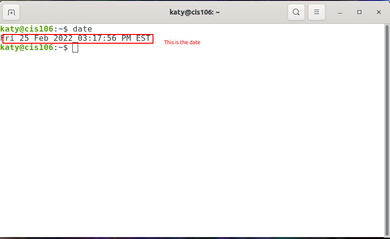
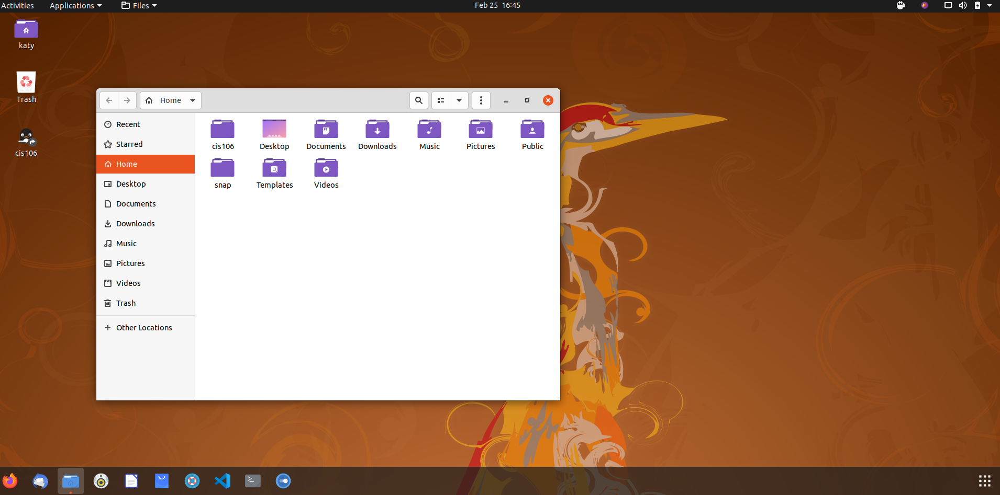
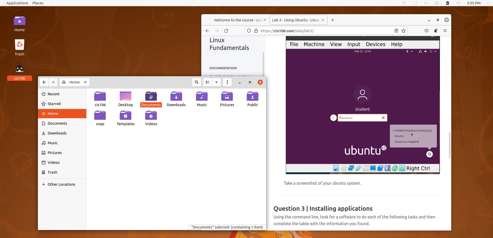

---
name:Katiuska
Class: cis106
Semester: Spring 22
---
# Lab 3 using Ubuntu

# Question 1

# Question 2

# Question 3

| Program purpose     | Package Name | Version  | Description                                    |
|---------------------|--------------|----------| -----------------------------------------------|
| Play a tetris game  | quadrapassel |1:3.36.0-1| tetris game                                    |
| Play a video file   | dragonplayer |4:19.12.3 |simple video player                             |
| Browse the internet |  falkon      | 3.1.0-0  | lightweight web browser based on Qt WebEngine  |
| Read your email     | kmail         | 4:19.12.3| full featured graphical email client          |
| Play music          |  lollypop    |1.2.35-1  | modern music player                            |

1- Commands answers:

* Sub question 1 :`sudo apt install quadrapassel -y`
* Sub question 2 :`sudo apt install dragonplayer -y`
* Sub question 3 :`sudo apt install dragonplayer -y`
* Sub question 4 :`sudo apt install dragonplayer -y`
* Sub question 5 :`sudo apt install lollypop  -y`
  
2- Remove all the programs that you installed in a single command. Which command did you use?
`sudo apt remove quadrapassel dragonplayer falkon kmail  lollypop -y`

3- If you were to install the first and second program, but remove the other 3 in a single command, Which command will you use?
`sudo apt purge quadrapassel+ dragonplayer+ falkon- kmail- lollypop-`

# Question #4
| command | what it does                                       |
|---------|----------------------------------------------------|
| echo    | display a line of text                             |
| fortune | print a random, hopefully interesting, adage       |
| cowsay  | configurable speaking/thinking cow (and a bit more)|
| lolcat  | rainbow coloring for text                          |
| figlet  | turns ordinary terminal text into big fancy letters                                                        |
| toilet  | display large colourful characters                 |
| rig     | Random Identity Generator                          |
