# Lab 4 The Linux File System

## Question 1: The linux filesystem 

|Directory|Function                                                                                                                                   |
|---------|-------------------------------------------------------------------------------------------------------------------------------------------|
|bin      |it is a subdirectory of the root directory that contains executable programs which are essential for booting purposes and system repairment|
|dev      |it contains special device files that control access to peripheral devices                                                                 |
|etc      |it contains all your system configuration in it.                                                                                           |
|home     |it is a place where by default all user home directories are created .It contains the personal files of a particular user of the system .   |
|media    | Directory for mounting files systems on removable media like CD-ROM drives, floppy disks, and Zip drives.                                 |
|opt      |it is reserved for all the software and add-on packages that are not part of the default installation.                                     |
|proc     | A special directory in a virtual filesystem. It contains the information about various aspects of a Linux system.                         |
|srv      | It holds site specific data to be served by the system for protocols such as, ftp, rsync, www, etc                                        |
|usr      | It is a secondary file hierarchy that contains shareable, read-only data.                                                                 |
|var      | It contains variable data files                                                                                                           |

|Command|           What it does                                              |           Syntax                                  |                Example              |
|-------|-------------------------------------------------------------------- |---------------------------------------------------|-------------------------------------|
|cd     |used to change the current working directory                         | `cd` + `Destination `                             |               `cd $HOME`            |
|pwd    |displays the current working directory                               | `pwd`                                             |                `pwd`                |
|ls     |displays all file inside a given directory /current working directory| `ls`+`option`+`paths`                             |            `ls -a Downloads`        |
## Question #2
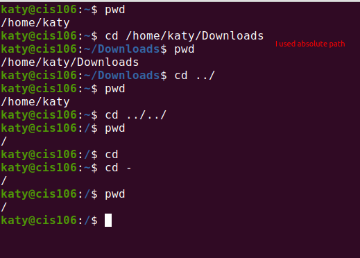
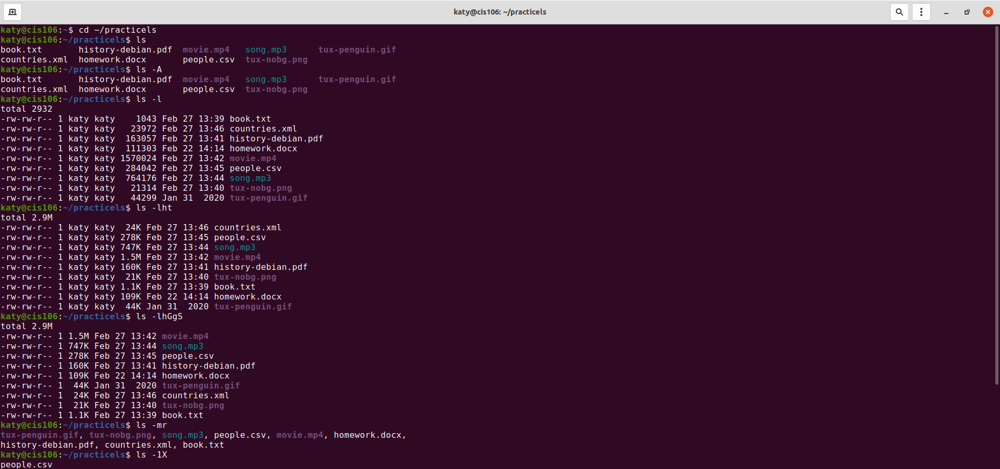
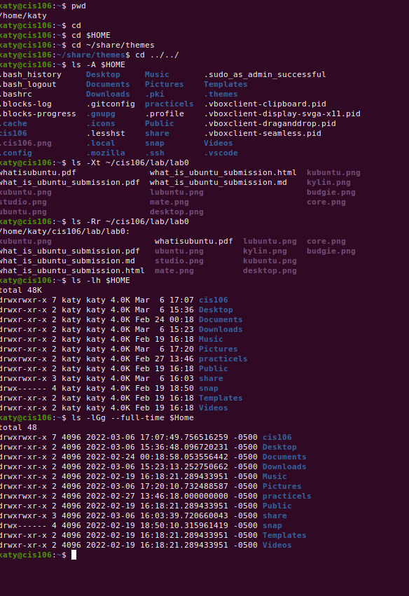
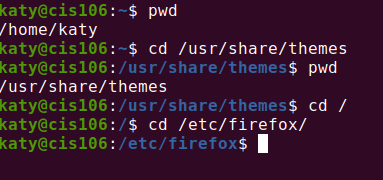
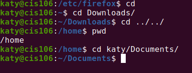

## Question 3
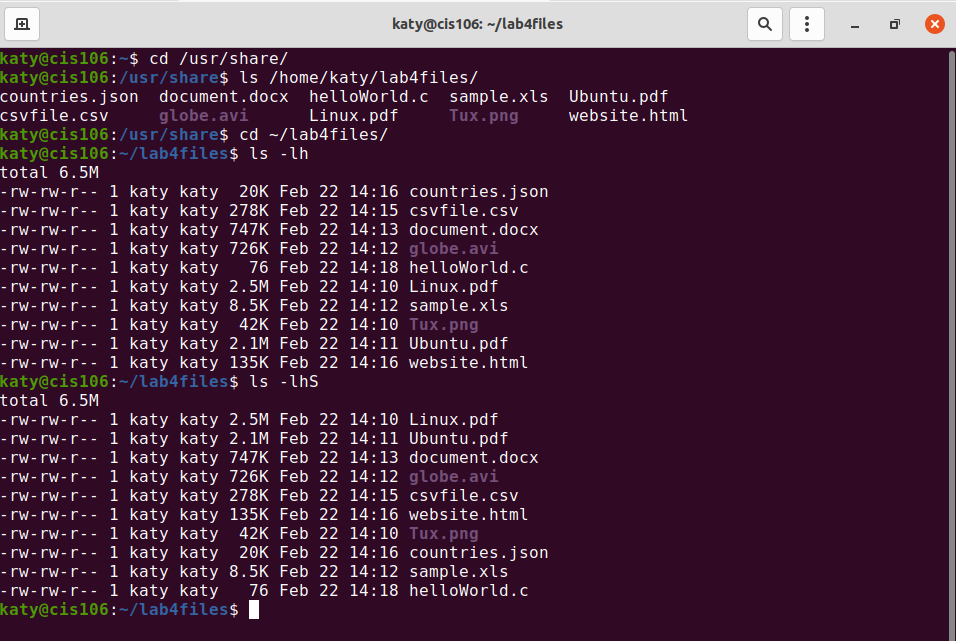
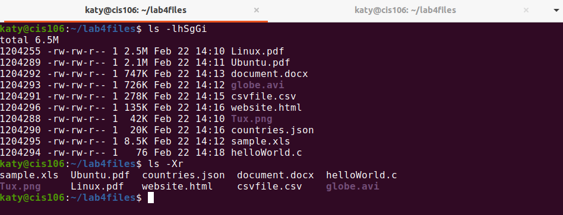

## Question 4
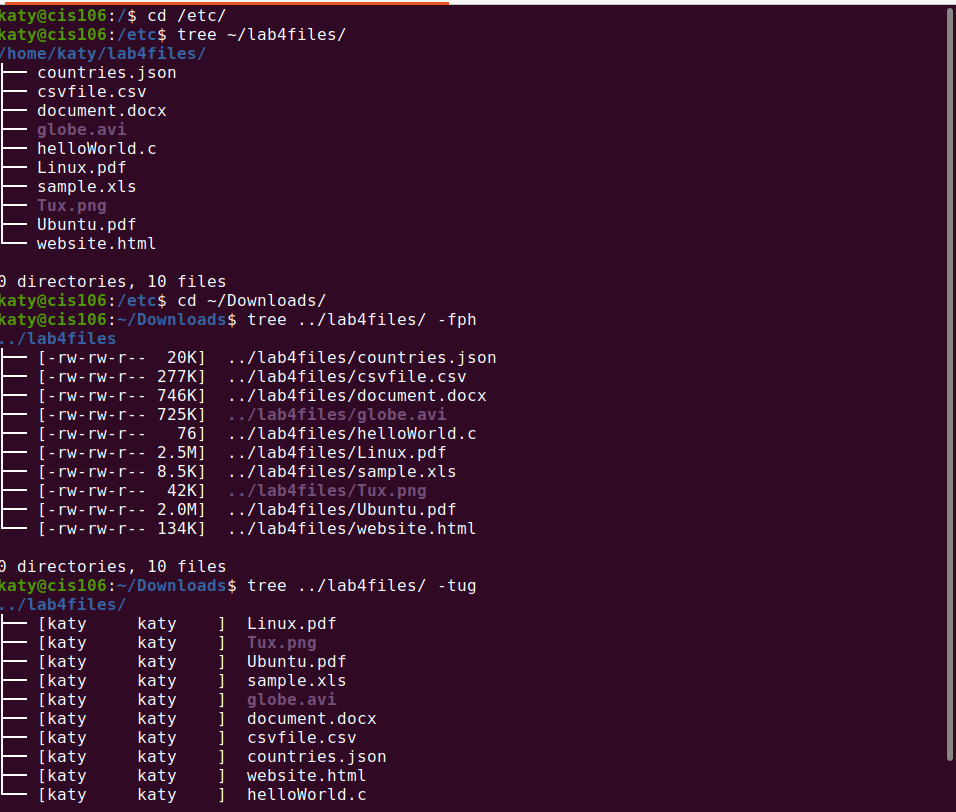
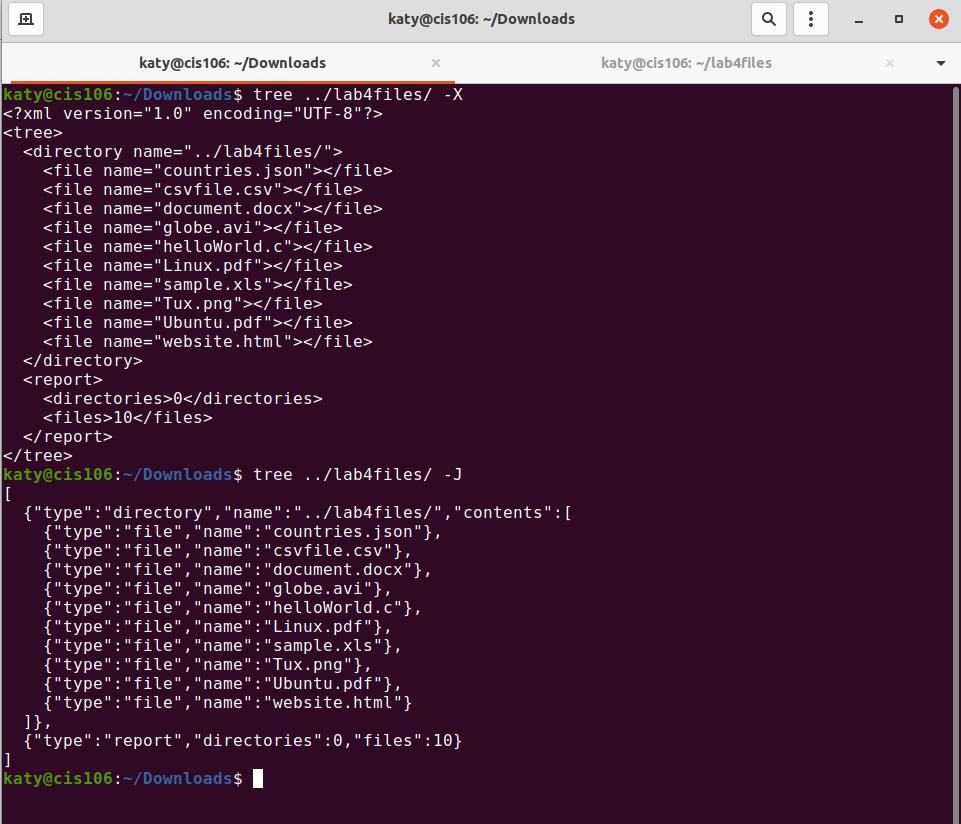

## Question 5
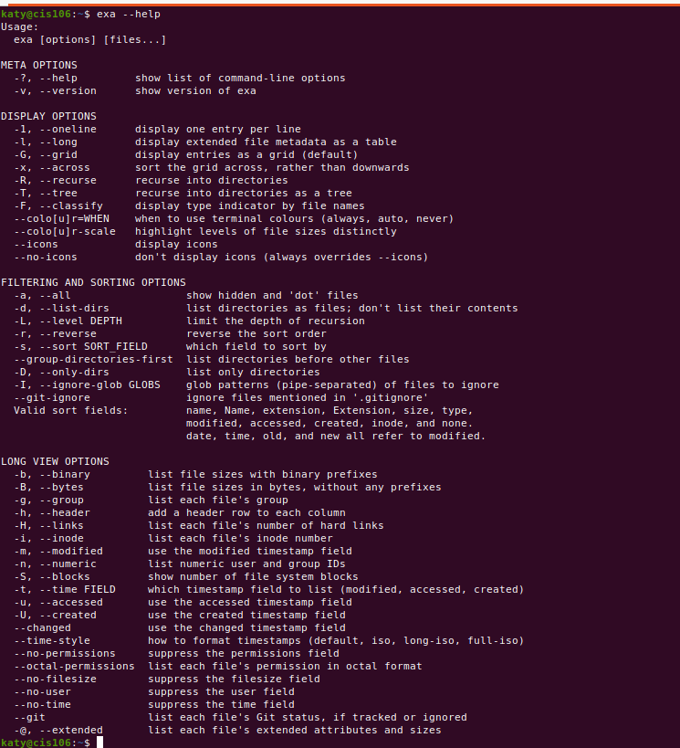
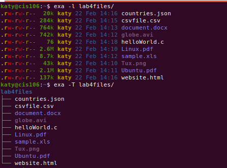
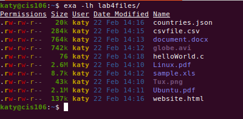
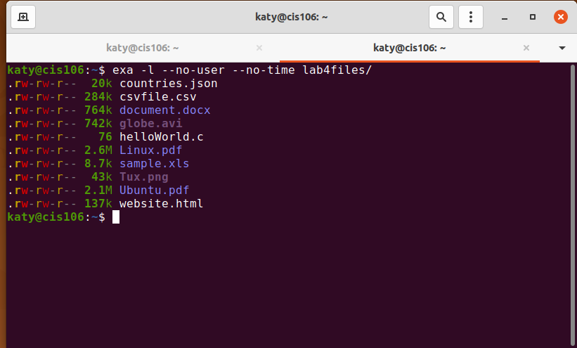

