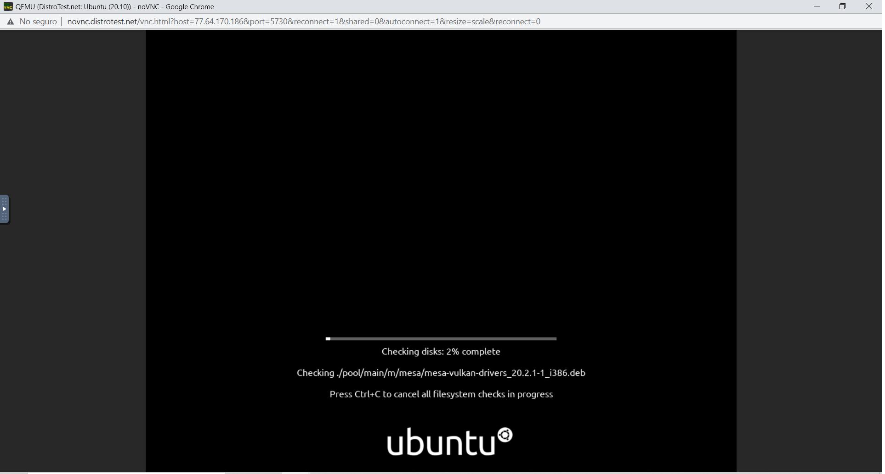

# Lab 1 exploring Linux distributions

## Question 1
1. What is the OS Type: **Linux**
2. Which major distro is it based on?  **Debian**
3. Which processor architecture does it support?  **armhf, ppc64el, riscv, s390x, x86_64**
4. Is the distribution active or is it discontinued? **Status: Active**
5. What is the distro’s home page?	**https://www.ubuntu.com/**

## Question 2
1. What is the name of the distribution and the OS Type: **The distribution name is Ubuntu Budgie,and the OS Type is Linux.**
2. Which major distro is it based on?  **Debian, Ubuntu**
3. Which processor architecture does it support?  **arm64, x86_64**
4. Is the distribution active or is it discontinued?**Active**
5. What is the distro’s home page? **https://ubuntubudgie.org/**

## Question 3
1. What is the name of the distribution? 	**MX Linux**
2. What is the country of Origin? **Greece**
3. What major distribution is it based on? **Debian (Stable), antiX**
4. What is the distribution category? **Desktop, From RAM, Live Medium, Raspberry Pi**
5. Which processor architecture, aside from the one in the original query, does the OS support?  **armhf, i686, x86_64**

## Question 4
### A Linux distribution used for Data Rescue/Data recovery
|Distro Name     |Website                     |Desktop Environment                     |
|----------------|----------------------------|----------------------------------------|
|**Kaisen Linux**|**https://kaisenlinux.org/**| **KDE Plasma, LXDE, MATE, Xfce**       |

### A Linux distribution used for Education that supports the ix86 processor architecture.
|Distro Name  |Website                     |Desktop Environment|
|-------------|----------------------------|-------------------|
|**ALT Linux**|**https://en.altlinux.org/**|**AfterStep, Blackbox, Cinnamon, Enlightenment, FVWM, GNOME, IceWM, KDE, LXDE, MATE, Openbox, LXQt, WMaker, Xfce**       |

### A Linux distribution that supports the OEM installation method

|Distro Name    |Website                   |Desktop Environment     |
|---------------|--------------------------|------------------------|
|**Linux Mint**	|**https://linuxmint.com/**|**Cinnamon, MATE, Xfce**|

## Question 5- Select one of these distributions and in a paragraph, share your thoughts. (keep it simple 5 to 8 sentences).

**The distro that I chose is called dahliaOs.DahliaOs is a contemporary Os resulting from the merger of the GNU/Linux and Fuchsia, which is responsive and secure. There are three features that I found interesting about this Os. The first feature is internet recovery, which boots the latest image if something goes wrong with the system. The second feature is built-in containers, which allow users to run almost all apps within the Os. Finally, it is a very compact Os. It only uses 199 MB of RAM when idle. I try the demo, and I have to say that its simplicity makes it very intuitive to use. It reminds me a lot of chrome os.**

## Question 6

