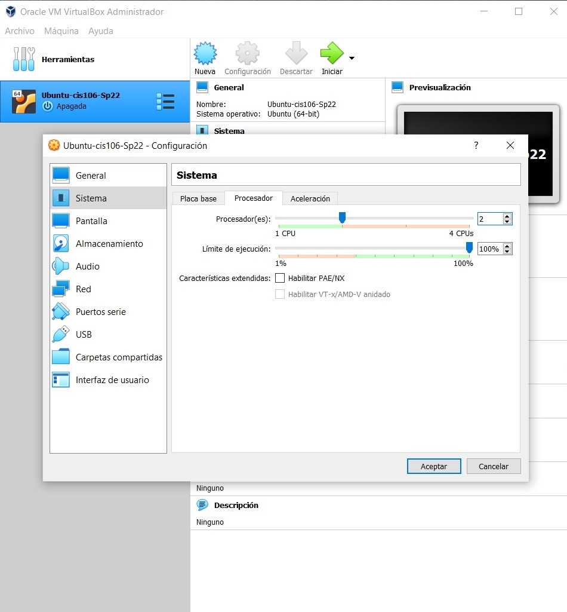

# Week Report 2
## Summary of Presentations

What is virtualization
- Simulation of a computer inside a  physical machine.
- There are 2 general types:
      - Server-side virtualization: process of creating multiple servers instaces from one physical server.
          * Virtual Desktop Infraestructure(VDI):
              + Thick client or fat client
              + Thin Client
              + Zero client
  
- Client-side virtualization: is a VM in the user's pc.
 + Characteristics:
   - Each pc has its own Os.
   - A hypervisor is needed to manage the VM.
- Type of hypervisor :
   * Type 1 runs on the hardware . It replaces the Os that you are using.ex,Vmware ESX/ESXI.
  
   * Type 2 runs on host Os installed in your pc. ex,Vmware workstation player/pro and Oracle virtualbox.
- Benefits of virtualization:
  - Allow you tested  before installing.
  - Reduces cost.
  - Increase the time labor.
  
 - Installing Ubuntu in Virtualbox 
 
 
 
 
 

**Raspberry pi**
- Small computer that can be plug into a monitor or tv
- Raspberry pi models:
   -   Raspberry PI 4
   - Raspberry PI 3
   - Pi Zero W
   - Pi 3 A+
   - Raspberry Pi 400
  

**Specs of the latest model (Raspberry pi 4 or 400) you can use a screenshot.**

- It's the most powerful Raspberry Pi  built into a compact keyboard.
- quad-core
- 64-bit processor
- 4 Gb of RAM
- wireless networking
- dual-display output
- 4k video playback
  

**5 projects you can do with a raspberry pi. Use the internet to find this information.**
- Speech Recognition
- Media Center
- Timelapse Camera
- Solar-Powered Bitcoin Miner
- Shutdown /Restart Button
  
  

