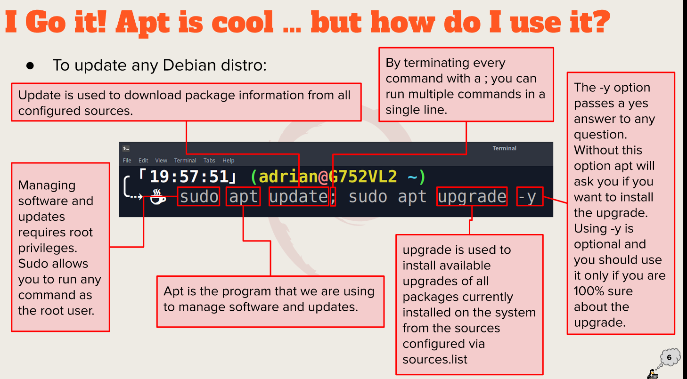

# Week Report 3

## Summary of Presentation: Lecture 3

1. Exploring Desktop Environments

- Different desktop environments
  - GNOME
  - MATE
  - CINNAMON
  - PANTHEON
  - KDE
  - BUDGIE
  - OPENBOX
  - DEEPING DE
  - XFCE
  - LXDE
  - LXQT
  - FLUXBOX
  
- Definitions for the following terms: GUI, DE
  
- GUI(graphical user interface): are programs that allow the users to interact with the computer through icons,windows ,etc.
  
- DE(desktop environments): are multiples programs that shares a common GUI.

- Bulleted list of the common elements of a desktop environment:
  
  - Display Manager: allows you to choose between the desktop environment.
  
  - File Manager: is in charge of file maintenance
  
  - Icons: picture that represents a program.
   
  - Favorites bar: popular icons located in the desktop.
  
  - Launcher: Overall view of programs and files.
  
  - Menus:contained files and programs.
  
  - Panels:rectangular areas located at the very top or bottom of a desktop environment’s main window.
  
  - System Tray: allows user t log out,lock their screen ,manage audio,view notifications,etc.
  
  - Widgets: programs that provide information or functionality on the desktop.
  
  - Windows Manager: programs that regulate how the windows are display.
  
2. The bash Shell
   
- What is a shell?
   A shell is a program that provides the traditional, text-only user interface for Unix-like operating systems.

- List different shells
  - Tcsh Shell
  - Csh Shell
  - Ksh Shell
  - Zsh Shell

- Bash shortcuts 
  
  - Ctrl+A : go to the start of the command line.

  - Ctrl+E : go to the end of the command line.
  
  - Ctrl+K : delete from cursor to the end of the command line.
  
  - Ctrl+Y : paste word or text that was cut using one of the deletion shortcuts.
  
  - Ctrl+XX: move between start of command line and current cursor position.
  
  - Alt+U :make uppercase from cursor to end of word.
  
  - Alt+I : make lowercase from cursor to end of word.
  
- List basic commands and their usage
  
  - date: displays the current time and date.
  
  - Cal :displays a calendar of the current month.
  
  - df  : displays the amount of free memory.
  
  - uname: displays information about the system.
  
  - Clear: clears the screen.

3. Managing Software.
   
    - a. Command for updating ubuntu
     `sudo apt update ; sudo apt upgrade -y`

    - b. Command for installing software
    `sudo apt install add-name -y`

    - c. Command for removing software 
    `sudo apt remove add-name`

    - d. Command for searching for software
    `apt search “add-name” `

    - e. Definition of the following terms:
  
      - Package: a recompilation of resources such as software, configuration files and information necessary to install programs

      - Library: reusable code.

      - Repository: collection of programs available to download.

    - f. Include the screenshot of how to update ubuntu with its explanation (page 6)
  
        

